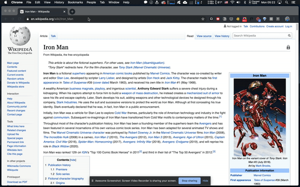

# TagHighlight

You can highlight whatever tag with whatever color you like on all webpages. Simply type `highlight` on the address bar (omnibox), then hit `tab` on you keyboard. Start inputing the `tag name`, separate by a `space`, then put the `color name` or `color code (in hex)` that you like.